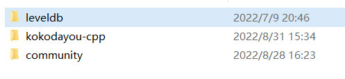
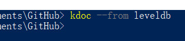
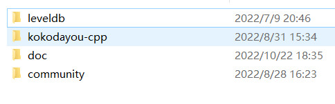
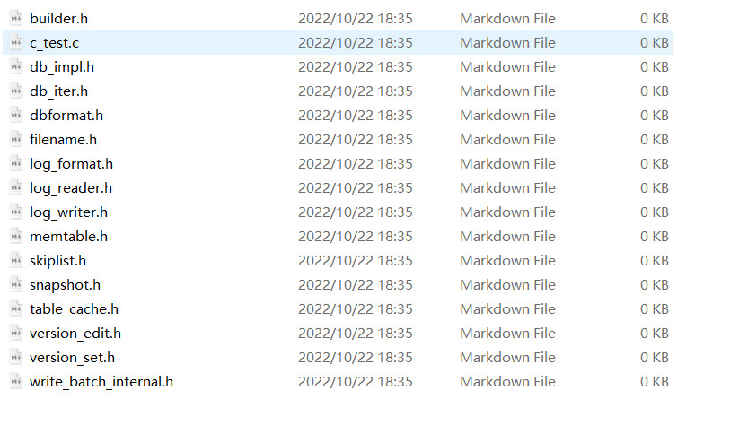

# *Kokodayo-Doc*

# 简介

本项目用于初始化项目开发文档结构，能够在保持文件夹结构的基础上为每一个程序文件生成一个**空的**markdown文档

# 安装与使用

```shell
git clone https://github.com/Morranto/kdoc.git

cd kdoc

cargo install --path .

kdoc --from <SomeDir>
```


假设我们对leveldb使用kdoc







点进去可见kdoc为每一个程序文件**空的**markdown文档


